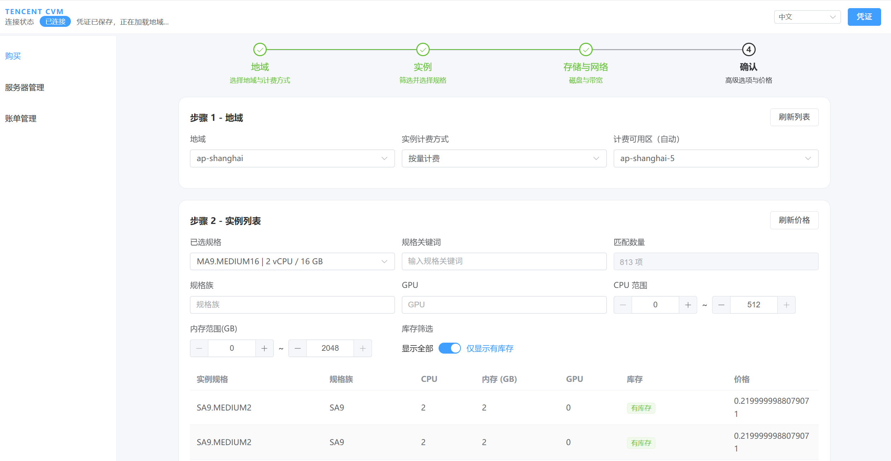

# Tencent CVM UI（中文说明）

这是一个面向腾讯云 CVM 的 Web 管理界面项目，提供实例购买、实例管理与账单查看等功能。



## 项目简介

本项目采用前后端分离式工程结构：

- 前端：Vue 3 + Vite + Element Plus
- 后端：Spring Boot + Maven
- 云接口：Tencent Cloud CVM / Billing 相关能力

适合作为：

- 腾讯云 CVM 管理工具
- 云资源操作后台
- 实例选型 / 购买流程项目模板

## 功能特性

- 实例购买流程
- 地区 / 可用区 / 实例规格 / 镜像筛选
- 实例生命周期管理
  - 开机
  - 关机
  - 重启
  - 销毁
  - 续费
  - 修改名称
- 账单与余额查看
- 导入 / 导出模板


## 腾讯云 SDK 选型

当前项目采用的腾讯云 SDK 方案如下：

- **CVM SDK**
  - Maven 坐标：`com.tencentcloudapi:tencentcloud-sdk-java-cvm`
  - 版本：`3.1.1290`
- **Billing 能力**
  - 当前项目中**未直接启用**独立的 Billing SDK 依赖
  - 账单相关能力通过项目内的自定义封装层接入 Tencent Billing OpenAPI

腾讯云 SDK 官方开源仓库：

- <https://github.com/TencentCloud/tencentcloud-sdk-java>

## 项目结构

```text
frontend-elementplus/   前端应用
src/main/java/          后端源码
src/main/resources/     配置与静态资源
docs/                   项目文档
scripts/                辅助脚本
```

## 快速开始

### 前端启动

```bash
cd frontend-elementplus
npm install
npm run dev
```

### 后端启动

```bash
mvn spring-boot:run
```


## 依赖与 SDK 选型

### 腾讯云 SDK

- CVM SDK：`com.tencentcloudapi:tencentcloud-sdk-java-cvm`
- 版本：`3.1.1290`
- 官方开源仓库：<https://github.com/TencentCloud/tencentcloud-sdk-java>

### Billing 说明

当前仓库中的账单能力通过项目内适配层接入，未直接启用独立 Billing SDK 依赖。

## 部署说明

英文部署文档见：

- [Deployment Guide](docs/deployment.md)

如果你需要中文部署文档，也可以继续补充一份 `docs/deployment.zh-CN.md`。

## 如何发布 GitHub Release

如果你已经打好了包（例如 `jar`、`zip`），可以通过 GitHub CLI 上传到 Release 页面。

### 方式 1：创建 Release 时直接带上文件

```bash
gh release create v1.0.0 ./app.jar ./dist.zip \
  --title "v1.0.0" \
  --notes "First public release"
```

### 方式 2：先创建 Release，再上传文件

```bash
gh release create v1.0.0 --title "v1.0.0" --notes "release notes"
gh release upload v1.0.0 ./app.jar ./dist.zip
```

### 覆盖已上传的同名文件

```bash
gh release upload v1.0.0 ./app.jar --clobber
```

## 说明

当前仓库为 GitHub 专用整理版，已移除环境相关隐私信息、内部部署细节与敏感配置。

## License

GNU General Public License v3.0 (GPL-3.0)
